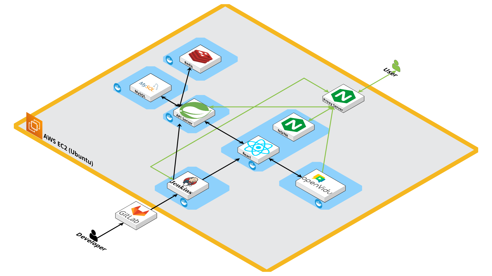

# 밀정 1931 ( WebRTC를 활용한 화상 마피아게임 )
SSAFY 11기 공통 프로젝트 부울경 1반 9013 (2024.07.02 ~ 2024.08.16)

# 목차
1. 서비스 소개
2. 서비스 화면
3. 팀원 소개 및 역할
4. 개발 환경
5. 활용 기술
6. 프로젝트 산출물
7. 개발 회고
---
</br>

# 1. 서비스 소개
1931년 상해 임시정부의 독립운동가를 배경으로 진행되는</br>
**→ WebRTC 기반의 화상채팅을 활용한 마피아 게임**

## 1.1. 배경 스토리

1919년 대한민국임시정부가 수립된 이후 대한민국 독립을 위해 독립운동을 지원해 물심양면으로 애쓰며 격동의 시기를 보내고 있었는데, 때는 1931년, 독립운동가가 모여있는 대한민국임시정부에 밀정이 숨어들었다는 첩보가 김구 선생에게 들어왔다. 김구 선생은 첩보원을 파견하여 숨어있는 밀정을 죽이려 한다.
그러나 첩보 소식이 알음알음 내부에 퍼졌고 독립운동가들은 투표로 직접 처단하기로했다. 또한 밀정들은 자기들을 조사하고 있는 첩보원을 먼저 제거하기로 결정했다.

## 1.2. 게임 구성 요소

1. **플레이어 수**: 최소 6명 이상 (이하 8명 기준으로 예시)
2. **역할 구성**:
    - 독립운동가: 4명 → 3명(변절자1명 추가시)
    - 첩보원: 1명
    - 밀정: 1명

### **역할 설명**
1. **독립운동가 (시민):**
    - 목표: 밀정과 변절자를 찾아내고 제거
    - 투표로 밀정과 변절자를 찾아내서 처단
    - 변절 가능성: 밀정에 의해 변절할 수 있음
    - 변절 시 투표에서 무효표를 던져야 함
2. **변절자:**
    - 원래 독립운동가였으나 밀정에 의해 변절
    - 변절 시 무효표를 던져야 함 (투표권X)
    - 밀정이 모두 죽으면 투표권 되살아남
    - 독립운동가로 남을지 선택 불가, 무조건 변절
    - 변절자만 남을 시 투표를 통해 독립운동가들을 다 죽이고 단독승리 가능
3. **첩보원 (경찰):**
    - 밤마다 한 명의 직업을 알 수 있음
    - 목표: 밀정과 변절자를 찾아내고 제거
    - 변절자가 변절되기 전 첩보 입수했기 때문에 , 독립운동가로 나타남
    - 첩보원이 변절자가 될 시 다음날 아침에 남은 독립운동가 중에서 랜덤으로 첩보원이 선출된다
4. **밀정:**
    - 독립운동가를 한 명 변절시키거나 살해 가능
    - 목표: 독립운동가와 첩보원을 모두 제거
    - 매 밤 한 명을 변절시키거나 살해 가능

## 1.3. 승리 조건

- **독립운동가**
    - 모든 밀정과 변절자를 사망
- **밀정**
    - 모든 독립운동가와 첩보원 사망
- **변절자**
    - 모든 독립운동가 사망 혹은
    - 밀정이 모두 죽은 후, 투표로 독립운동가와 1:1 상황 만들기 (단독승리)

## 1.4. 게임 진행 방식

1. **역할 배정**
    - 모든 플레이어는 랜덤으로 역할 배정
2. **낮 (투표 시간)**:
    - 모든 플레이어가 서로의 정체를 추측하며 토론
    - 투표로 밀정 의심자 처단
    - 처단된 사람은 역할 공개 후 게임에서 제외
3. **밤 (능력 사용 시간)**
    - 밀정: 한 명을 변절시키거나 살해
    - 첩보원: 한 명의 역할 확인
    - 변절된 사람은 무효표 던짐
4. **반복**
    - 낮과 밤을 반복하며 승리 조건 충족할 때까지 게임 진행


# 2. UCC & 시연
<video controls src="exec/docImg/밀정 게임방법.mp4" title="Title"></video>

# 3. 팀원 소개 및 역할
- 김강진 : 팀장 | Infra, GIT 관리, BE·FE 백업 및 BE - User 관련 로직 및 API(Spring Security + JWT), Front-OpenVidu 연결
- 김송희 : 부팀장 | FE - MainPage, GameListPage, ProfilePage 및 User Modal / Jira(일정 관리), 웹디자인, PPT
- 박수빈 : FE - GamePage(WebSocket), AchievementsPage / PPT
- 김종훈 : BE - OpenVidu, GameListPage API / 발표
- 김현우 : BE - User 관련 로직 및 API(Spring Security + JWT) / 기획, UCC, 발표
- 이현규 : BE - Game 및 GameList 관련 로직 및 API(WebSocket)

# 4. 개발 환경
## 4.1. 서비스 아키텍처


## 4.2. Frontend
```
- Node.js 22.5.1(LTS)
- React 18.3.1
    - Redux 9.1.2
    - Reduxjs/Toolkit 2.2.6
    - Router 6.25.1
- axios 1.7.2
- animejs 3.2.2
- socket-io: 4.7.5
- Openvidu Browser 2.30.1
- jwt-decode 4.0.0
- styled-components 6.1.12
- websocket 1.0.35
```
## 4.3. Backend
```
- Spring Boot
    - Spring Web
    - Spring Reactive Web
    - Spring Security
    - OAuth2 Client
- DB
    - JDBC API
    - Spring Data JPA
    - H2 Database
    - MySQL Driver
    - Spring Data Redis
    - Redisson Spring boot starter
- Websocket
    - Java Mail Sender
- SMTP
    - WebSocket
    - Spring Boot Actuator
- openvidu-java-client 2.30.0
- Utill
    - Lombok
    - Validation
```
## 4.4. Server
```
- Ubuntu 20.04 LTS
- Nginx 1.18.0
- Docker 27.0.3
- Docker Compose 2.28.1
- OpenVidu 2.30.0
- Jenkins 2.45.2.3
```
## 4.5. DB
```
- H2 (Develop)
- MySQL 8.0 ( Deploy )
- Redis 6.2.14
```
## 4.6. 형상 / 이슈 관리
```
- Jira
- GitLab
```

# 5. 프로젝트 산출물
- [기획서](https://www.notion.so/b17538af6c0343f0b7156eae0ffdd37a)
- [API 명세서](https://www.notion.so/API-85c7a13ae56845a1adc38b5033d36adc)
- [ERD](https://www.erdcloud.com/d/YNgbFNX88PYkmn25M)
- [MockUp](https://www.figma.com/design/FTYpmwfohdbuqjMFuiseeF/240717_%EA%B3%B5%ED%86%B5PJT_WireFrame%2BMockUp?node-id=0-1&t=dbiz8yWT06EF8sPI-0)

# 6. 개발 회고
## 김강진
이번 프로젝트에서 팀장, Infra 등을 맡아서 개발하였습니다. Docker, Jenkins 이용해서 배포환경 구축도 진행해보고, Openvidu + React 이용해서 개발도 진행해보고, Git 관리도 전체적으로 좀 해볼 수 있어 좋았습니다.
프로젝트에서 개발 외적인 부분들도 많이 배우고 가는 것 같습니다.
개발에서 많은 부분을 빼고 가게 되어 아쉬운 부분은 있지만, 끝까지 포기하지 않고 개발해준 팀원들에게 감사합니다.
다들 이번 프로젝트 고생많으셨습니다!

## 김송희 
이번 프로젝트를 통해서 전반적인 웹개발 프로젝트 진행 흐름과 구조에 대해 배웠습니다. 또한 프론트엔드의 역할과 원활한 소통을 위해서 어떤 개발자가 되어야 하는지에 대해서 다시 한번 생각해보는 계기도 되었습니다. 담당한 부분이 아니더라도 정확한 기술 구현까지는 못하더라도, 전체적인 내용에 대해 알고, 공부할 필요가 있음을 느꼈습니다.
처음 기획에 비해 기간 내에 구현하지 못한 기능들이 있어 아쉽지만, 개발 일정의 마지막의 마지막까지 포기하지 않고 노력해 준 팀원들께 감사합니다. 팀원들에게도 많은 것들을 배웠고, 덕분에 이만큼 해낼 수 있었던 것 같습니다.
감사합니다. 수고하셨습니다!

## 박수빈 
게임 로직을 짜면서 ‘1학기 때 알고리즘 열심히 풀 걸..’이라는 생각을 가장 많이 했습니다. 이번 프로젝트를 하며 axios, 웹소켓을 이용해 프론트와 백엔드를 연동하는 걸 처음 해봤는데 처음에는 어려웠지만 팀원들의 도움이 있어 해낼 수 있었던 것 같습니다. 특히 백엔드를 담당한 두 팀원이 제가 짠 자바스크립트 코드를 읽고 수정해줬습니다. 프론트 담당이면 리액트, 자스만 잘하면 된다고 생각했는데 백엔드에 대한 이해도 어느 정도 있어야겠다고 생각했습니다.  업적 부분을 구현하지 못한 게 아쉬웠지만 이번 프로젝트를 통해 리액트로 많은 경험을 해본 것 같아 재밌었습니다. 이번 프로젝트를 발판으로 다음 프로젝트도 열심히 하겠습니다. 팀원들 모두 정말 수고많으셨습니다.

## 김종훈 
저는 WebRTC를 담당하면서 OpenVidu를 공부하였습니다. 처음에는 어떻게 사용하는 건지 전혀 감이 안잡혔지만, 공식문서와 공식예제를 보며 2주 정도 열심히 공부하였더니 대강 어떻게 흘러가는 지를 알 수 있었고, 이를 프로젝트에 적용해 볼 수 있었습니다.
가끔씩 일어나는 비디오 오류를 해결하지 못했다는 점과 직업, 시간에 따라 비디오/오디오 켜짐 유무를 결정하는 로직이 완벽하게 돌아가지 않았다는 점이 조금 아쉬웠습니다. 하지만 공식문서로 기술을 공부해보았다는 부분과 React의 컴포넌트 생명주기등을 공부해볼 수 있다는 점이 좋았습니다.
다들 이번 프로젝트 고생하셨습니다!

## 이현규
이번 프로젝트에서 WebSocket과 STOMP 그리고 Redis에 대해서 많은 학습을 하여서 좋았습니다. 또한 Redisson락이 무엇인지 공부하고 왜 쓰는지 이해한 뒤에 AOP로 만드는 과정에서 배운게 많은거 같습니다.  이번 프로젝트에서 일정관리나 다른 부분에서도 배운게 많은데, 이를 다음 프로젝트에 열심히 써먹을 예정입니다.
다들 수고많으셨습니다! 야호!

## 김현우 
이번 프로젝트에서 게임 전체적인 스토리 구상과 로직구상을 담당해서 기획할 수 있어 좋았습니다. 처음 계획했던 많고 재밌는 기능들을 구현하지 못해 개인적으로 아쉬웠고 개발 쪽으로는 Data-JPA와 JWT를 이용해서 처음 개발해서 많이 어려움을 겪었지만 그래도 성장할 수 있어서 좋았습니다. 
마지막으로 UCC 개발과 프로젝트발표와 같은 평소의 저라면 도전하지 않았을 업무도 담당해봐서 좋은 경험이었던것 같습니다. 
다들 수고했어요!